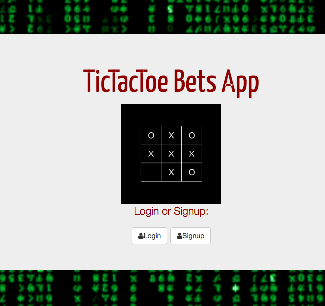

#  Tic Tac Toe Bets App
 Build a full stack app that uses user authentication.

## Installation

1. Clone repo
2. run `npm install`

## Usage

1. run `node server.js`
2. Navigate to `localhost:8080`

## Link To Live Site:
www.kennethscruz.com

## Credit

Modified from Scotch.io's auth tutorial

## Tech used: HTML,CSS, Javascript (Node)

 I would like to do more with my CSS work and make the design cleaner. Also I would like to add more user "winning" features to the project

## Lessons learned:
It was fun learning to use CRUD functionalities
